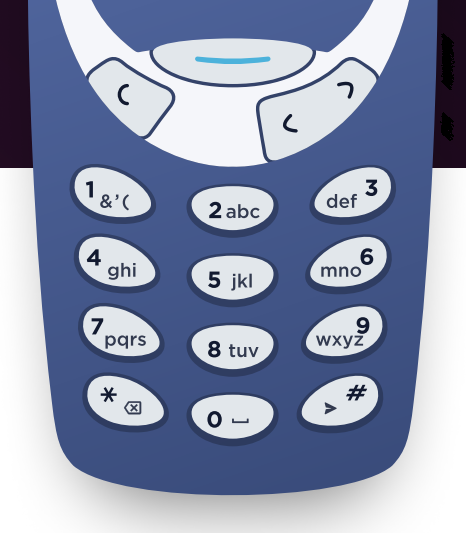

<h1> Old Phone KeyPad</h1>


Old Phone KayPad is a console application that allows users to convert numeric keys to alphabetical letters.
<ul>
<li>
In the keypad, each number has letters assigned. For instance, the number 2 has the letters A, B, and C assigned to it.</br>
If you want to type the letter "B" press the number "2" button two times.
</li>
<li>
To type the same letter twice, you just need to wait for a second in the real world. In this program, you can use space for that action.
</li>
<li>
The symbol '*' is used for backspace action to delete the previous letter.</br>
</li>
<li>
'#' symbol is used to send the message and in this program, it refers to the end of the string.</br>
</li>
</ul>

<h2> Framework </h2>
<ul>
<li><a href="https://dotnet.microsoft.com/download/dotnet/6.0">.Net 6  </a></li>
<li>Console Application</li>
<li>xUnitTest</li>
</ul>

<h2>Branches </h2>
<ul>
  <li>main [for latest stable code]</li>
</ul>


<!-- GETTING STARTED -->
## Getting Started

This is an example of how you may give instructions on setting up your project locally.
To get a local copy up and running follow these simple example steps.

### Prerequisites

This is an example of how to list things you need to use the software and how to install them in window.
* winget
  ```sh
  winget install Microsoft.DotNet.SDK.6
  ```

### Installation

_Below is an example of how you can instruct your audience on installing and setting up your app. This template doesn't rely on any external dependencies or services._

1. Clone the repo
   ```sh
   git clone https://github.com/MyoDev00/PhonePad.git
   ```
3. Go to project directory
   
2. Build application
   ```sh
   dotnet build
   ```
3. Run
   ```js
   dotnet run --project OldPhonePad
   ```


<!-- USAGE EXAMPLES -->
## Usage
Program will ask for input.
```js
Enter input =>22#
```

Type valid input string and press enter,

If input string is invalid, you will get an error message.
```js
Invalid input,input be number,white space or * and must be end with #
```

Else result will print
```js
Alphabetic Letter =>C
```

And Finally It will ask to continue or not,Type `Y` or `y` for restart from start and `N` or `n` to stop.
```js
Do you want to continue? Y/N or y/n
```

<h2>Documentation</h2>
<ul>
  <li><a href="https://github.com/MyoDev00/PhonePad/blob/main/OldPhonePadDoc.md">IOldPhonePadService</a></li>
</ul>

